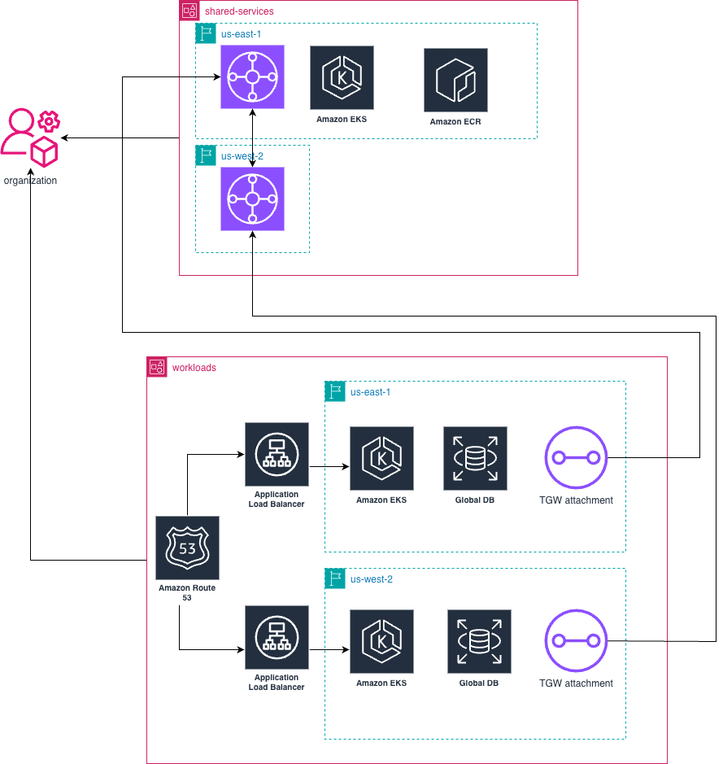

# Observability Platform with Multi site approach

This project deploys a production-grade observability stack using Pulumi and AWS EKS with a foundation for disaster recovery (DR multi site approach) across multiple AWS regions. The goal is to create a scalable, resilient, and automation-friendly monitoring system that enables zero-ops observability and serves as the backbone for future multi-region cell-based architecture.
---

## Architecture Diagram

This is high overview diagram, later on it maybe will be updated.


---

## Project Goals

- Deploy a full observability stack (Cortex, Grafana, Loki) in a centralized **shared AWS account**.
- Use **Pulumi (TypeScript)** to manage all infrastructure as code.
- Build a reusable base for **multi-account, multi-region** architecture with **Transit Gateway + IPAM**.
- Implement **Multi-Site approach** strategy using AWS-native tools like Route 53 and Global Databases.
- Learn new IaC tools for such scenario
---

## Architecture Overview

### Multi-Region Deployment

The platform now supports deployment across two regions using a multi-site approach:

- **Primary Region**: us-east-1 (default)
- **Secondary Region**: us-west-2 (default)

### AWS Accounts

| Account Role        | Purpose                                  | Regions |
|---------------------|------------------------------------------|---------|
| `shared-services`   | Observability platform, central EKS,     | Both    |
|                     | VPC IPAM, Transit Gateway, RAM shares    |         |
| `workloads`         | Application workloads, databases         | Both    |

### Infrastructure Components by Account

#### Shared Services Account
- **Primary Region (us-east-1)**:
  - Transit Gateway (ASN: 64512)
  - Hub VPC (10.0.0.0/16)
  - Shared EKS Cluster for monitoring
- **Secondary Region (us-west-2)**:
  - Transit Gateway (ASN: 64513)
  - Hub VPC (10.2.0.0/16)
  - Shared EKS Cluster for monitoring

#### Workloads Account
- **Primary Region (us-east-1)**:
  - Spoke VPC (10.1.0.0/16)
  - Transit Gateway Attachments
  - Workload EKS Cluster
  - RDS Aurora Global Database (Primary)
  - Route 53 Failover Records
- **Secondary Region (us-west-2)**:
  - Spoke VPC (10.3.0.0/16)
  - Transit Gateway Attachments
  - Workload EKS Cluster
  - RDS Aurora Global Database (Secondary)

### Core Components

- **EKS Cluster (shared-monitoring)**: Hosts Cortex, Grafana, Loki (via Helm).
- **Transit Gateway (network-core)**: Connects shared services to app cells.
- **IPAM & RAM**: Centralized subnet CIDR management and VPC sharing.
- **ECR**: Shared container registry for monitoring workloads.
- **Pulumi**: Used to deploy and manage all infrastructure and Helm charts.

---

## Observability Stack

Deployed into the shared EKS cluster:

- `Cortex`: Metrics collection from workloads (via service discovery).
- `Grafana`: Prebuilt dashboards, alerts via Slack/Webhooks.
- `Loki + Tempo`: Centralized logging and tracing.
- `Need to chose`: Alert routing for incidents.

All components are provisioned via Pulumi and Helm.

---

## Workload Stack

Deployed into the workloads EKS clusters across 2 regions:

- `Strimzi + Mirror Maker 2.0`: Kafka cluster deployed across 2 regions with 2 side replication
- `Mircoservice architecture`: With tracing enabled

All components are provisioned via Pulumi and Helm.

---

## 🌐 Disaster Recovery Strategy

This project implements the **Multi-Site DR** model:

| DR Feature           | Implementation                                                |
|----------------------|---------------------------------------------------------------|
| **Health checks**    | AWS Route 53 HTTP checks on `/healthz` endpoints              |
| **Failover Routing** | Route 53 records with Primary/Secondary endpoints             |
| **Databases**        | RDS Global Database with cross-region replication             |
| **Kafka**            | Strimzi + MirrorMaker2  with replication enabled              |
| **DR Region**        | Minimal app footprint pre-provisioned via Pulumi              |

### RTO/RPO Targets

| Metric     | Target                              |
|------------|-------------------------------------|
| **RTO**    | < 5 minutes                         |
| **RPO**    | < 1 minute (via Global RDS + Kafka) |

## Quick Start

### Prerequisites
1. Two AWS accounts (shared-services and workloads)
2. IAM roles configured for cross-account access
3. Environment variables set (see `.env.template`)

### Deployment
```bash
# Copy and configure environment variables
cp .env.template .env
# Edit .env with your account IDs and role ARNs

# Install dependencies
npm install

# Preview the deployment
npm run preview:multi-region

# Deploy all infrastructure
npm run deploy:multi-region
```

For detailed deployment instructions, see [DEPLOYMENT_GUIDE.md](./DEPLOYMENT_GUIDE.md).

---